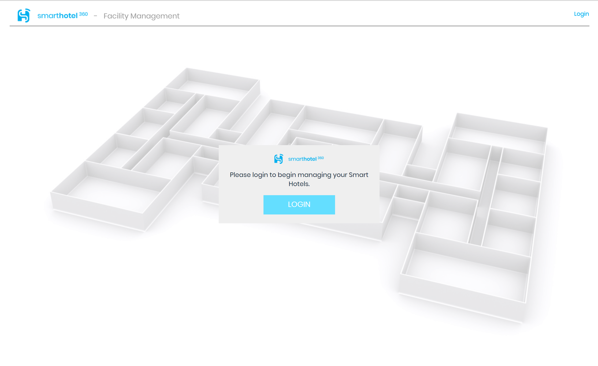
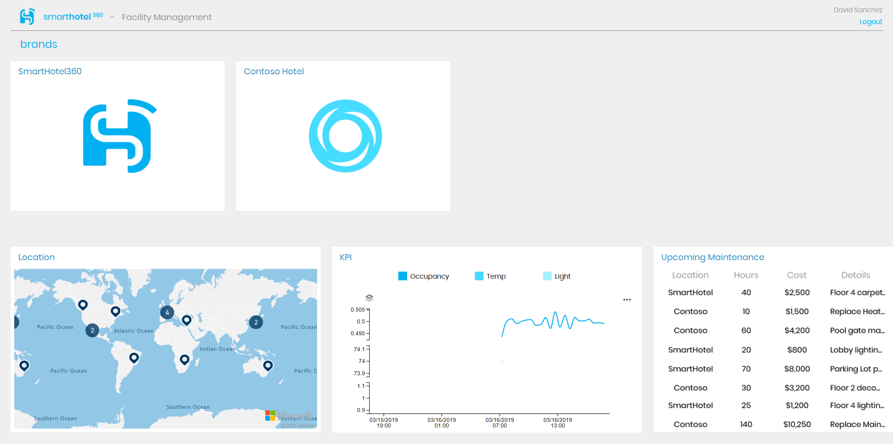
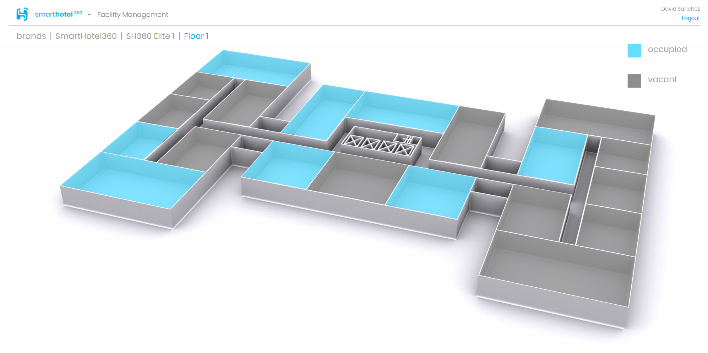
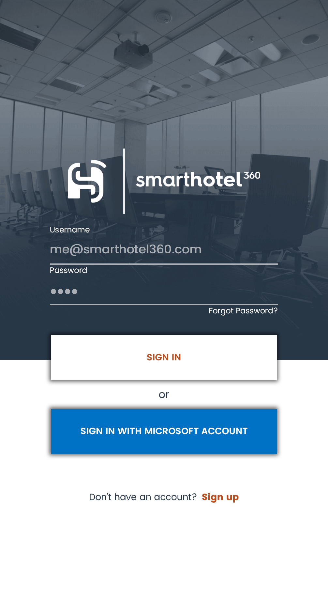
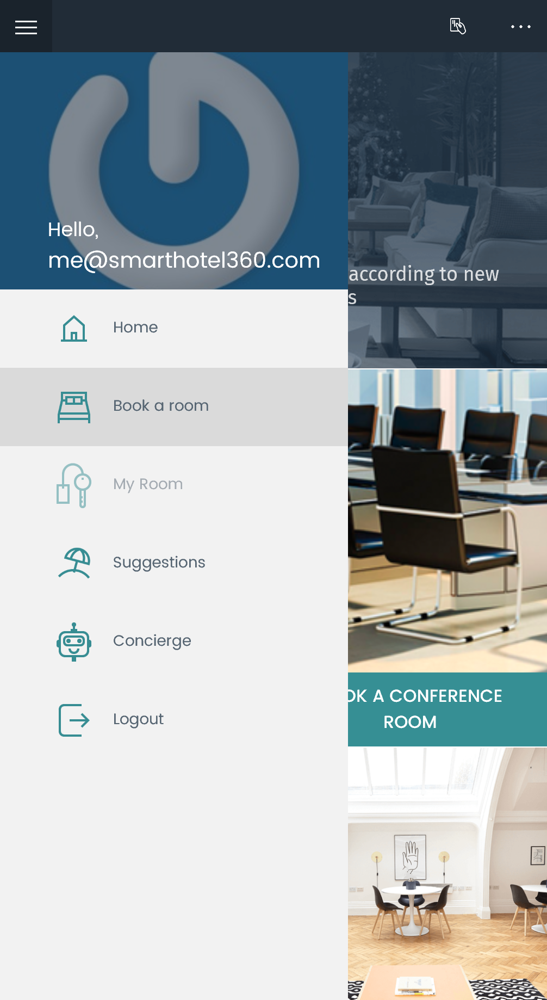
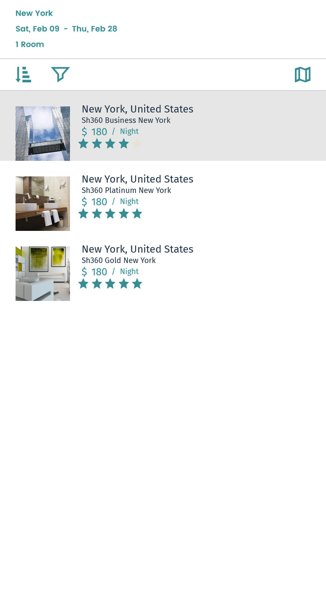
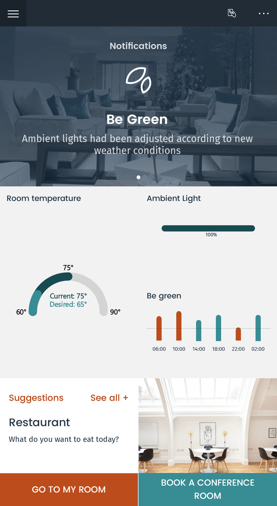
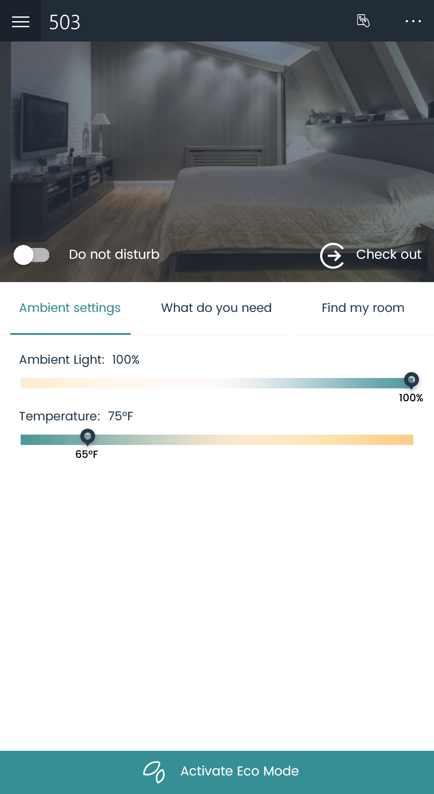

# Next-generation Internet of Things Solutions using Azure Digital Twins

## Introduction

SmartHotel360 has implemented a Hotel Management solution built on top of Azure Digital Twins. The goal of the solution is to generate critical insights from the hotel to optimize building and energy efficiency, improve occupant experience and productivity of hotel personnel. This solution empowers both the Occupant and the Hotel employees (from Head of Operations to Managers) to control and remotely change settings of rooms, as well as ensure the hotel is always operating to its maximum efficiency.

## Key Takeaways

The key takeaways of this demo are:

* **Azure Digital Twins** a new platform that enables comprehensive digital models and spatially aware solutions that can be applied to any physical environment. Create uniquely relevant experiences by correlating data across the digital and physical worlds.

* **End-To-End IoT Solution** with this demo you can learn how the different devices and services can interact between each other to have a complete solution.

## Before you begin

You will need to have provisioned a demo environment following the **[setup guide](https://github.com/Microsoft/SmartHotel360-IoT#setup)** with the **[Xamarin Mobile app](https://github.com/Microsoft/SmartHotel360-Mobile#iot-demo)** configured.

## Walkthrough: Facility Management Website

1. In the SmartHotel360 Facility Management. We will login as the Hotel Manager, who has maximum access and permissions and can access every hotel that exists with within the SmartHotel360 brand.



2. The SmartHotel360 Manager needs to make sure that everything is functioning properly from an operational standpoint, optimize efficiency of the hotels and ensure that occupants are having the best experience possible at the SmartHotel360.

They also can see various operational data points that can help drive more informed decision-making. Concretely, they can see:

* Operating KPIs including visitor distribution by purpose of visit (Vacation, Business, etc.)
* Location information of the hotels.
* Scheduled maintenance and upcoming maintenance.



3. Click on Floor 1, the facility manager can now access the specific rooms that make up the first floor with live data points being retrieved from the individual spaces themselves.
In this case, SmartHotel360 has populated the rooms with three key indicators:

* Whether it’s currently occupied or vacant.
* The current temperature in the room.
* The current lighting in the room.



The Hotel personnel, depending on the access and permissions granted to them, can also use this data to improve occupant experience by ensuring that the comfort levels are aligned to the preferences of the occupant.

Another feature worth highlighting here is the **Twin Object Models**. We know that Hotels have different types of rooms and that these rooms vary significantly, For example, here see King rooms, Queen rooms, a Gym, etc.

With the Twin Object Models feature that exists in Azure Digital Twins, organization can add different types of rooms to more precisely reflect their real physical environment.

So customers can more accurately reflect the amenities and characteristics of these rooms in their **Azure Digital Twins** instance.

4. Let's focus on the **room 101** supposing a new guest asked us to set the temperature to 65° F and the lights to 100% brightness. Change the values using the slider.

## Walkthrough: Occupant Experience

SmartHotel360 solution built on Azure Digital Twins also offers the occupant the benefit of increased control of their room conditions and other actions by means of a mobile app.
The first action that must be performed by the occupant is to Book a Room.

1. Login into the mobile app. You can use the generic account or a Microsoft Account (Live ID).



> Note: Generic credentials are:
```
Username: me@smarthotel360.com
Password: 1234
```

2. You will need to **Book A Room**, use the link from the home page or in the left menu.



3. Select the city, dates and hotel that you want. It is a fictitious data, so your preference won't affect the demo flow. Then click on **Book Now** and confirm.



4. Once you have booked the room you have access to the overview of the **room settings**.



5. Using the left menu select **My Room** and then **Ambient Settings**.



6. Here you can change the values for **lights** and **temperature** and those values will reflect on the **Facility Management** website.


## Summary

What we’ve shown here is how Microsoft and SmartHotel360 are working together, using Azure Digital Twins through an IoT Solution to improve operational and energy efficiency, optimize space utilization and enhance occupant experience.